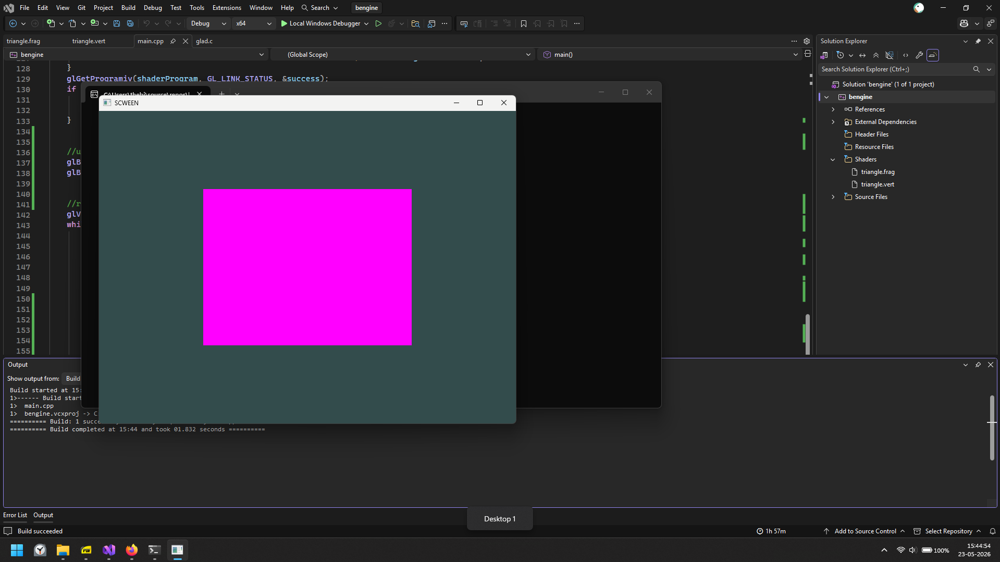
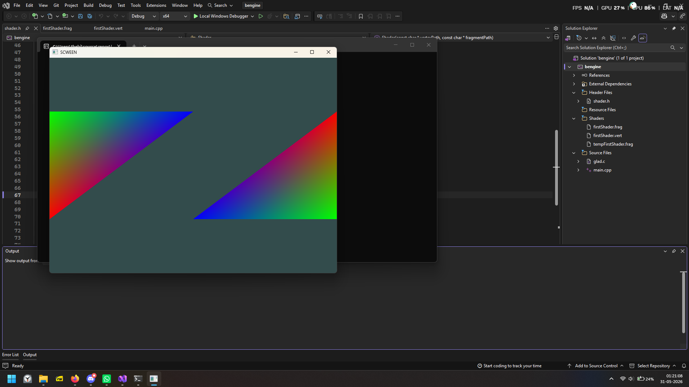
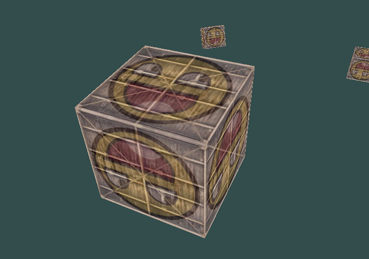
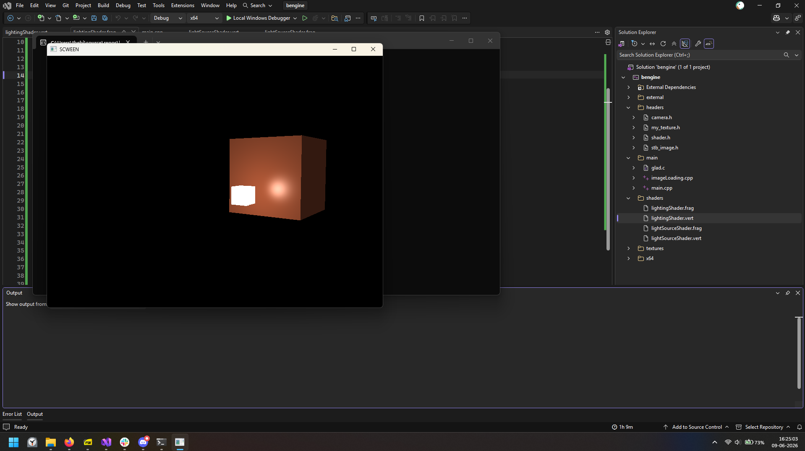
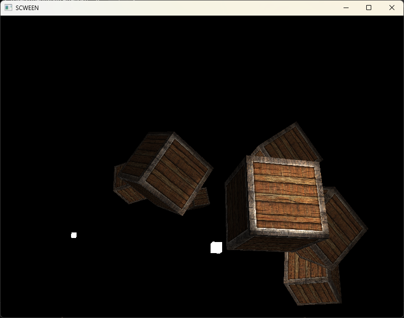
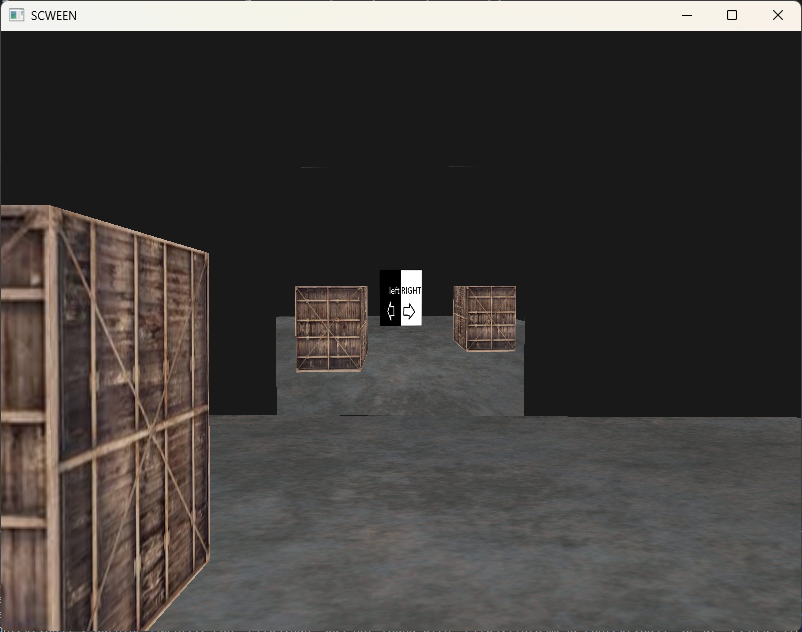
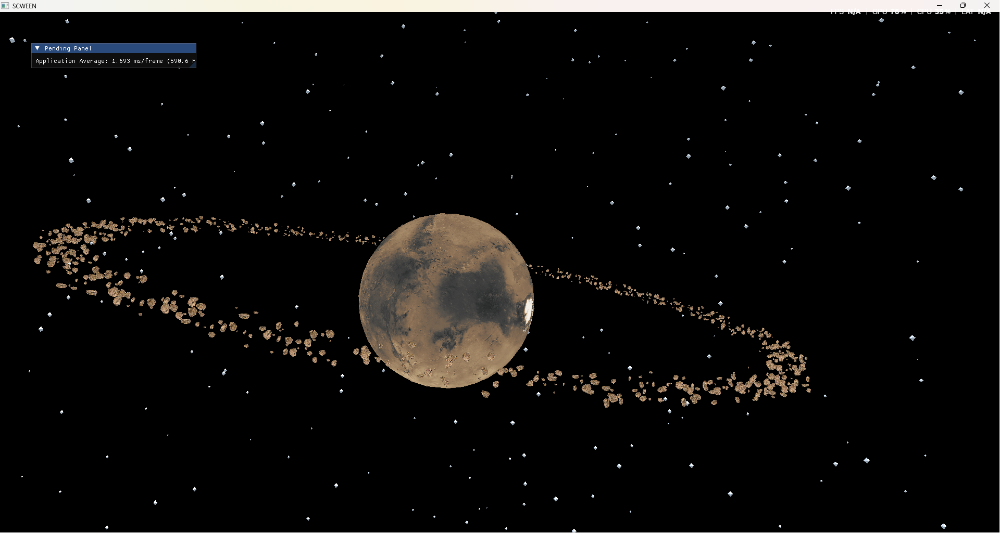

# bengine
The learnopengl tutorial engine as my intro to engine dev and graphics programming. I aim to understand graphics concepts with the help of this engine so I can shift to vulkan/directX later and make use of advanced graphics techniques!

---
## Note for latest build:
if you dont see the planet, thats because you are inside of it, I am sorry about that, just step back or move around to have it in the frame

---
## How to Build
* open the bengine.slnx file
* press the start without debugging option OR press ctrl + f5
* if there are missing .dll files, copy the contents of the dlls folder to the bengine.exe directory

---
## Controls

Get around the scene using the following keyboard and mouse configurations:

| Key / Input | Action |
| :--- | :--- |
| **W, A, S, D** | Move the camera Forward, Left, Backward, and Right |
| **Mouse Move** | Look around / Rotate camera orientation |
| **Mouse Scroll** | Zoom in and out/ change the FOV |
| **E / Q** | Move vertically downwards / upwards |
| **Escape** | Close program |
| **Left Alt** | Toggle mouse cursor unlock / Lock to screen |
| **Left Shift** | Holding it increases the camera speed(move around faster) |

---

## What I Learnt
here is a list of what I learnt about:
* OpenGL
* buffers
* shaders - vertex, geometry, fragment
* linear algebra in computer graphics
* phong lighting model
* instanced rendering
* post processing

---

## Gallery

Images of renders I happen to take along the way

### First render

*Image 1: proud father of a rectangle*

### Second render

*Image 2: How I split it into two and made it colorful*

### Going 3D

*Image 3: going a dimension deeper*

### let there be light

*Image 4: implementd single source phong lighting*

### more lights!

*Image 5: implementd multi source phong lighting*

### Framebuffer Mirror

*Image 6: A mirror but no face.*

### Instanced Star and rocks System

*Image 7: Thousands of generated stars rendered in real-time utilizing instanced arrays.*

---

## Build & Requirements
* **Language:** C++17 or higher
* **Graphics API:** OpenGL 3.3 Core Profile
* **Dependencies Included:** GLFW, GLAD, GLM, Assimp, ImGui, stb_image
